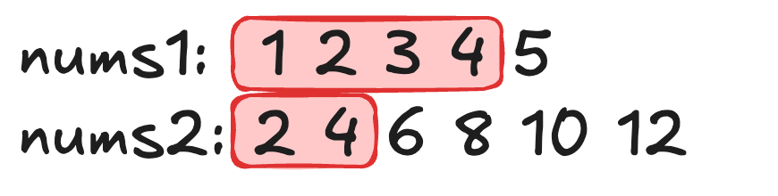

## 题目描述
给定两个大小分别为 `m` 和 `n` 的正序（从小到大）数组 `nums1` 和 `nums2`。请你找出并返回这两个正序数组的 **中位数** 。

算法的时间复杂度应该为 $O(log (m+n))$ 。

**示例 1：**
```
输入：nums1 = [1,3], nums2 = [2]
输出：2.00000
解释：合并数组 = [1,2,3] ，中位数 2
```

**示例 2：**
```
输入：nums1 = [1,2], nums2 = [3,4]
输出：2.50000
解释：合并数组 = [1,2,3,4] ，中位数 (2 + 3) / 2 = 2.5
```

**提示：**
- `nums1.length == m`
- `nums2.length == n`
- `0 <= m <= 1000`
- `0 <= n <= 1000`
- `1 <= m + n <= 2000`
- `-10^6 <= nums1[i], nums2[i] <= 10^6`

## 分析
寻找两个数组的中位数，可以转化为寻找两个数组中第 k 小的值。

如下图所示，由于 `k` 的值是固定的，因此红框的总大小不变，当上面的红框缩小时，下面的红框相应增大，维持框内数字总数为 `k`。在本题中，可认为 `k = （m + n + 1) / 2`. 



由于是寻找第 `k` 小的数，因此必须满足 左边红框中的最大值 $\leq$ 右边的最小值。设 $nums1=a,nums2=b$，红框中最大的两个值即为 $a_i,b_j$，即需要满足 
$$max(a_i,b_j)\leq min(a_{i+1},b_{j+1})$$
进一步得到
$$a_i\leq b_{j+1} \\
b_j\leq a_{i+1}$$
当 $m + n$ 为偶数时，中位数为 $\frac{max(a_i,b_j)+min(a_{i+1},b_{j+1})}2$，当 $m + n$ 为奇数时，中位数为 $max(a_i,b_j)$.

找到了约束条件，下面来考虑做法。

先控制 $a.length\leq b.length$ 使得 $k \geq \frac{a.length}2$，这样上面的红框大小可能为 $0$，我们在穷举上面的红框变化时可以从大小为 $0$ 开始。

只需要通过二分法查找满足 $a_i\leq b_{j+1}$ 的最大的 $a_i$，即最大的 $i$.

时间复杂度为 $O(log (min(m, n)))$.

## 实现
```java
class Solution {
    public double findMedianSortedArrays(int[] nums1, int[] nums2) {
        //  控制 m <= n
        if (nums1.length > nums2.length) {
            int[] temp = nums1;
            nums1 = nums2;
            nums2 = temp;
        }
        int m = nums1.length, n = nums2.length;
        // (left, right) 为开区间
        int left = -1, right = nums1.length;
        while (left + 1 < right) {
            int i = (left + right) / 2;            
            int j = (m + n + 1) / 2 - 2 - i; // 由于数组序号从 0 开始，因此要减2
            // 这里不用担心数组越界，因为会直接跳出循环
            if (nums1[i] > nums2[j + 1])
                right = i;
            else    
                left = i;
        }
        int i = left, j = (m + n + 1) / 2 - 2 - i;
        // 边界控制较为复杂，将其拆开逐个击破
        int ai = i < 0 ? Integer.MIN_VALUE : nums1[i];
        int ai1 = i == m - 1 ? Integer.MAX_VALUE : nums1[i + 1];
        int bj = j < 0 ? Integer.MIN_VALUE : nums2[j];
        int bj1 = j == n - 1 ? Integer.MAX_VALUE : nums2[j + 1];
        int max = Math.max(ai, bj);
        int min = Math.min(ai1, bj1);
        return (m + n) % 2 == 0 ? (max + min) / 2.0 : max;
    }
}
```