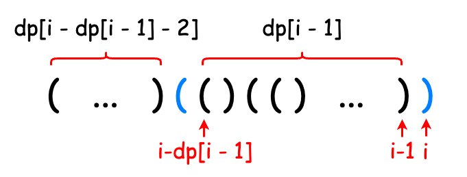
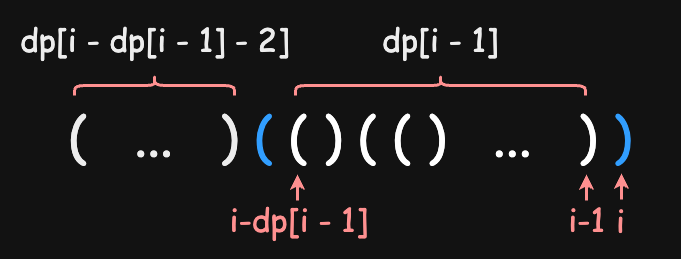

## 题目描述
给你一个只包含 `'('` 和 `')'` 的字符串，找出最长有效（格式正确且连续）括号子串的长度。

 

**示例 1：**
```
输入：s = "(()"
输出：2
解释：最长有效括号子串是 "()"
```
**示例 2：**
```
输入：s = ")()())"
输出：4
解释：最长有效括号子串是 "()()"
```
**示例 3：**
```
输入：s = ""
输出：0
 ```

**提示：**

- `0 <= s.length <= 3 * 10^4`
- `s[i]` 为 `'('` 或 `')'`

## 分析
### 解法一：栈
括号问题首先想到的就是用栈。我们可以扫描字符串，遇到 `'('` 则入栈，遇到 `')'` 则匹配栈中元素并出栈。有两个问题需要考虑：1）如何处理多余的左括号？2）如何在遇到未匹配的右括号时重置计数器？

为了解决这两个问题，我们将入栈的元素选定为 `'('` 在字符串中的下标。
- 对于问题 1），在计算有效字串长度时，使用 **`')'` 的下标** 减去 **栈顶元素**，避免重复计算；
- 对于问题 2），我们将最后遇到的未匹配 `')'` 的下标放入栈底，在遇到 `')'` 且栈中只有一个元素（即最后一个 `')'` 下标）时，更新栈底元素的值为新遇到的 `')'` 下标，这样在计算有效长度时会被该值截断，防止计算多余长度。

整体流程如下：
- 初始化栈（加入 `-1` 作为默认的 `')'` 下标）
- 扫描字符串
    - 遇到 `'('`：将其下标入栈
    - 遇到 `')'`：
        - 栈中只有栈底元素：更新栈底元素
        - 否则，弹出一个 `'('`，计算有效长度并更新结果

### 解法二：动态规划

这题也可以考虑使用动态规划进行分析。

使用一个 `dp` 数组记录下以第 `i` 位结尾的有效子串长度，下面来分析转移方程。

- 若第 `i` 位为 `'('`，以第 `i` 位结尾的字符串必然不合法，因此 `dp[i] = 0`
- 若第 `i` 位为 `')'`，则需往前找与其匹配的 `'('`：
    - 若第 `i - 1` 位为 `'('`，则直接匹配，加上 `'('` 之前的有效子串长度，`dp[i] = dp[i - 2] + 2`；
    - 若第 `i - 1` 位为 `')'`，则我们需要找到以第 `i - 1` 位为结尾的有效子串的前一位，即第 `i - dp[i - 1] - 1` 位，若为 `'('`，则匹配成功，`dp[i] = dp[i - 1] + dp[i - dp[i - 1] - 2] + 2`。注意不要漏项。

{: .light}
{: .dark}
> `dp[i] = dp[i - 1] + dp[i - dp[i - 1] - 2] + 2` 看起来很复杂，其实很简单，我们逐项分析：
> - `dp[i - 1]` 为以第 `i - 1` 位结尾的有效串长度；
> - `dp[i - dp[i - 1] - 2]`：以第 `i - 1` 位结尾的有效串起始位为 `i - dp[i - 1]`，则以第 `i` 位结尾的有效串的前一个有效串的结尾为第 `i - dp[i - 1] - 2` 位，该串长度为 `dp[i - dp[i - 1] - 2]`；
> - 本身两个括号占两个长度。
>
> 因此， `dp[i]` 即为这三项加起来之和。
{:  .prompt-tip}

计算转移方程时，注意确保下标大于等于 `0`.

## 实现
### 解法一：栈
```java
class Solution {
    public int longestValidParentheses(String s) {
        Stack<Integer> stk = new Stack<>();
        stk.push(-1);
        int maxans = 0;
        for (int i = 0; i < s.length(); i++) {
            if (s.charAt(i) == '(') {
                stk.push(i);
                continue;
            }
            if (stk.size() > 1) {
                stk.pop();
                maxans = Math.max(maxans, i - stk.peek());
            } else {
                stk.pop();
                stk.push(i);
            }
        }
        return maxans;
    }
}
```
### 解法二：动态规划
```java
class Solution {
    public int longestValidParentheses(String s) {
        if (s.length() == 0)
            return 0;
        int[] dp = new int[s.length()];
        dp[0] = 0;
        int ans = 0;
        for (int i = 1; i < s.length(); i++) {
            if (s.charAt(i) == '(') {
                dp[i] = 0;
                continue;
            }
            if (s.charAt(i - 1) == '(') {
                if (i >= 2) 
                    dp[i] = dp[i - 2] + 2;
                else 
                    dp[i] = 2;
            }
            else if (i - dp[i - 1] - 1 >= 0 && s.charAt(i - dp[i - 1] - 1) == '(') {
                if (i - dp[i - 1] - 2 >= 0) 
                    dp[i] = dp[i - 1] + dp[i - dp[i - 1] - 2] + 2;
                else 
                    dp[i] = dp[i - 1] + 2;
            }
            else
                dp[i] = 0;
            if (dp[i] > ans)
                ans = dp[i];
        }
        return ans;
    }   
}
```