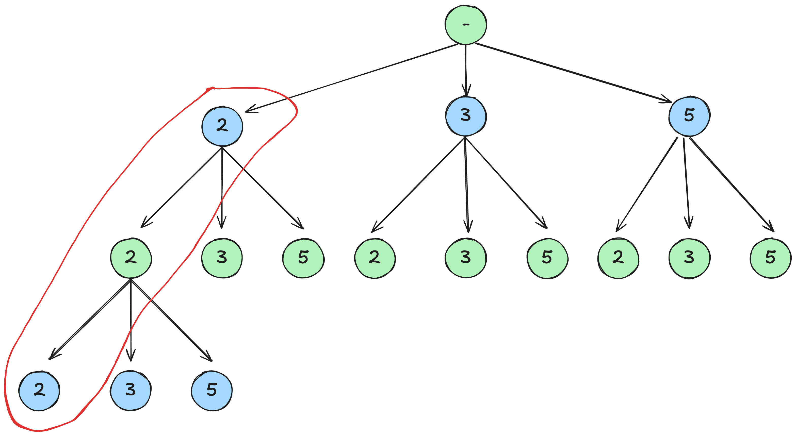
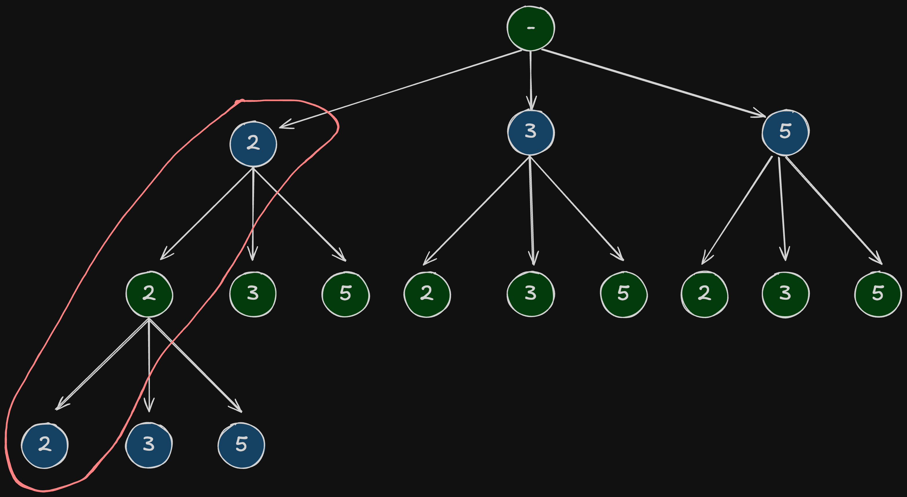

## 题目描述
给你一个 **无重复元素** 的整数数组 `candidates` 和一个目标整数 `target` ，找出 `candidates` 中可以使数字和为目标数 `target` 的 **所有** 不同组合 ，并以列表形式返回。你可以按 **任意顺序** 返回这些组合。

`candidates` 中的 **同一个** 数字可以 **无限制重复被选取** 。如果至少一个数字的被选数量不同，则两种组合是不同的。 

对于给定的输入，保证和为 `target` 的不同组合数少于 `150` 个。

 

**示例 1：**
```
输入：candidates = [2,3,6,7], target = 7
输出：[[2,2,3],[7]]
解释：
2 和 3 可以形成一组候选，2 + 2 + 3 = 7 。注意 2 可以使用多次。
7 也是一个候选， 7 = 7 。
仅有这两种组合。
```

**示例 2：**
```
输入: candidates = [2,3,5], target = 8
输出: [[2,2,2,2],[2,3,3],[3,5]]
```

**示例 3：**
```
输入: candidates = [2], target = 1
输出: []
```

**提示：**

- `1 <= candidates.length <= 30`
- `2 <= candidates[i] <= 40`
- `candidates` 的所有元素 **互不相同**
- `1 <= target <= 40`

## 分析
这题可以作为回溯的一个模版题。经验性地，当题目需要寻找“所有可行方案”时，可以考虑采用回溯处理。

回溯算法的运行过程实际上是图示树的建立过程：

{: .light}
{:   .dark}

每个节点代表选择的数字，一条从 `root` 到 `leaf` 的路径代表一种选择方案。

需要建立 **一个** `path` 列表用来保存每次从 `root` 到 `leaf` 的路径和一个 `result` 列表用来保存所有可行的 `path`。每次调用回溯函数时，先在 `path` 中加入当前节点，返回前删除当前节点，因此只需要一个 `path` 列表即可，节省空间，同时每次保存结果需要新建一个 `path` 的复制列表，防止被后续过程修改。

为了防止重复计算，在回溯函数 `backtrack` 中加入 `ind` 参数，遍历时从 `ind` 开始即可。

在实现时，由从零开始增加选择的值改为从 `target` 开始减少选择的值，从而不必传递一个中间值用于保存当前的和。

## 实现
```java
class Solution {
    public List<List<Integer>> combinationSum(int[] candidates, int target) {
        List<List<Integer>> result = new ArrayList<>();
        List<Integer> path = new ArrayList<>();
        backtrack(result, path, candidates, target, 0);
        return result;
    }

    void backtrack(List<List<Integer>> result, List<Integer> path, int[] candidates, int target, int ind) {
        if (target == 0) {
            result.add(new ArrayList<>(path));
            return;
        }
        for (int i = ind; i < candidates.length; i++) {
            if (target - candidates[i] < 0)
                continue;
            path.add(candidates[i]);
            backtrack(result, path, candidates, target - candidates[i], i);
            path.remove(path.size() - 1);
        }
    }
}
```